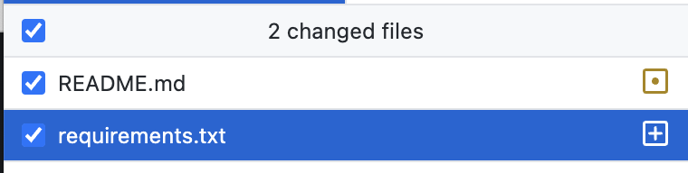
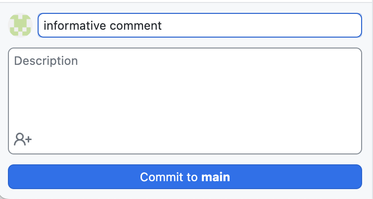

# Debugging Guide

[](https://github.com/DS-100/debugging-guide/actions/workflows/pages/pages-build-deployment) [](https://github.com/DS-100/debugging-guide/actions/workflows/a11y.yml)

Website link: https://ds100.org/debugging-guide/

## Accessibility Checks

Accessibility checks run whenever you push changes to the repository. View results in the Actions tab. You can also download reports generated by individual action runs.

If you'd like to run checks locally, first ensure you have quarto and Node.js installed. Then run `quarto preview --render all` which will preview the site at http://localhost:xxxx and generate `docs/sitemap.xml`. If the sitemap already exists, you can skip the `--render all` flag. Note the port number. From a second terminal, run the following with the correct port number:
```
axe $(cat docs/sitemap.xml | grep -o "<loc>[^<]*" | sed 's/<loc>//' | sed 's|https://ds100.org/debugging-guide|http://localhost:xxxx|') \
  --tags wcag2a,wcag2aa,wcag21a,wcag21aa \
  --exit
```

## Repo Setup

### Quarto Set-Up

Begin by [installing Quarto](https://quarto.org/docs/get-started/).

Texts can be authored in Quarto using VSCode, JupyterLab, or classic Jupyter Notebook. We suggest using [VSCode](https://quarto.org/docs/get-started/hello/vscode.html)

### Cloning the Repo
After you've installed quarto, go into your terminal on your *local* device and type 

`git clone https://github.com/DS-100/debugging-guide.git`

If you're unable to clone the repo, please contact the head/infra TAs to make sure you have read/write access to this repository. 

### Environment Setup
This section will ensure that you have all the necessary packages to render the website and is identical to the corresponding section in the [course-notes repo](https://github.com/DS-100/course-notes). We recommend using Conda ([download here](https://www.anaconda.com/download)) to keep track of your environment. 

Run the following in your terminal within the main directory: 

```
conda create --name data100quarto 
conda activate data100quarto
pip3 install -r requirements.txt # will take a while
ipython kernel install --user
```

If you get an `error: externally-managed-environment` on the third line, run `pip3 install -r requirements.txt --break-system-packages`. You may also run into issues if you're running on Apple silicon. I fixed this by running `conda install -c conda-forge scikit-learn==1.2.2 scikit-image==0.25.2` before `pip3 install -r requirements.txt`.

Remember to always activate the right environment before running anything with `conda activate data100quarto`.


## Repo Organization
This website uses Quarto to render pages. The main index can be found in `_quarto.yml`, and subpages are organized under the `chapters` section. Each subpage has it's own folder and `.md` (markdown) file. Note that unlike the [Course Notes repo](https://github.com/DS-100/course-notes), the debugging guide rarely runs any code, so we rely on `.md` files rather than `.qmd` to save us the trouble of converting from `.qmd` to `.ipynb` for editing, then back to `.qmd` to render the website. Instead we can make edits directly to the `.md` file. 

## Creating a new section
To start a new document, create an empty folder `topic_name` and create an empty markdown file `topic_name.md`. Start each document like so: 

```
---
title: INSERT_TOPIC_TITLE
format:
  html:
    toc: true
    toc-depth: 5
    toc-location: right
    code-fold: false
    theme:
      - cosmo
      - cerulean
    callout-icon: false
jupyter:
  jupytext:
    text_representation:
      extension: .qmd
      format_name: quarto
      format_version: '1.0'
      jupytext_version: 1.16.1
  kernelspec:
    display_name: Python 3 (ipykernel)
    language: python
    name: python3
---
```

Now, the notebook is ready for writing content.  In VSCode, you can activate a live preview of markdown files by clicking the button on the upper right-hand corner.


Note that clicking on the quarto `Preview` button does not generate a *live* preview but rather a static one. Hence, we click the button on its right. 

## Document Formatting
**Always `git pull` before making any new changes**. 

A pdf view of how this notebook renders in Quarto can be found [here](https://drive.google.com/file/d/17ga5wvfcmvAzQ1rbnCP4kEf5bckST3--/view?usp=sharing).

#### Formatting Images

To give you the most control when inserting images, we use html with the following format to center images/figs and control their size: 

```<center></img></a></center>```

For example, `<center></img></a></center>`.


## Generating Output + Rendering Website
After making edits to the `.md` files, ensure that the right documents are un-commented under `_quarto.yml`'s `chapter` section. Then, make sure you're using the right environment, and run `quarto render` in the main folder to render the entire website.

To preview your changes, run `quarto preview`.

## Pushing to Github
Once you're satisfied and *thoroughly tested* your changes, you can push your edits onto Github. There are two ways to do this: 

1. **Command Line**. Navigate to the main `debugging-guide` folder if you haven't already and make sure you're in the right environment. 

```
git add . # this makes sure git tracks any new files created
git commit -m <your message here> # please commit with an informative message
git push # push your changes to github
```

2. **Github Desktop** ([download](https://desktop.github.com/)). This is the GUI version of the command line. 

  * Choose the files you want to commit on the left hand menu. By default, github will select all changes/new files. 
  * Write an informative comment on the bottom left hand corner and click "commit to main" once finished 
  * Push your changes using the button on the top right. 

Once your changes are pushed, you can see the progress of your build in the ["Actions" tab](https://github.com/DS-100/debugging-guide/actions); green means the website built successfully, yellow/orange indicates that it's still building, and red means there was an error and the website was unable to build. The website  should take less than 5 minutes to build, and you will see the changes reflected in the [website](https://ds100.org/debugging-guide/). 


## Other Quarto Resources

[Quick Start Guide](https://quarto.org/docs/get-started/)

[Comprehensive Guide](https://quarto.org/docs/guide/)

[Markdown in Quarto](https://quarto.org/docs/authoring/markdown-basics.html)
