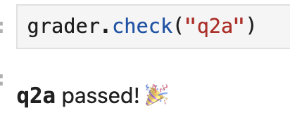
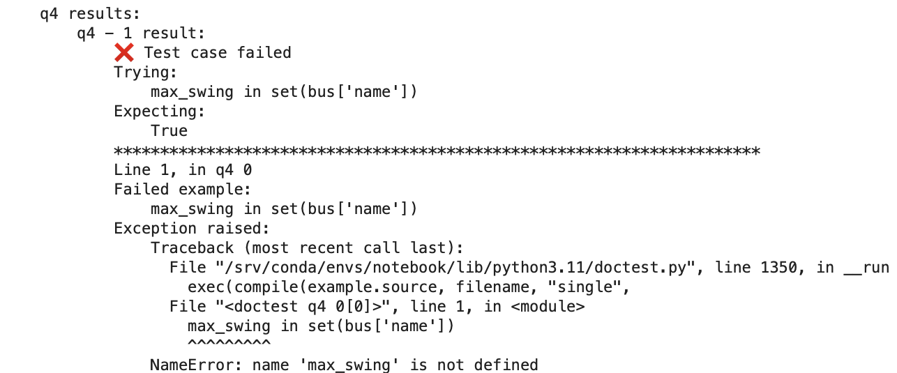
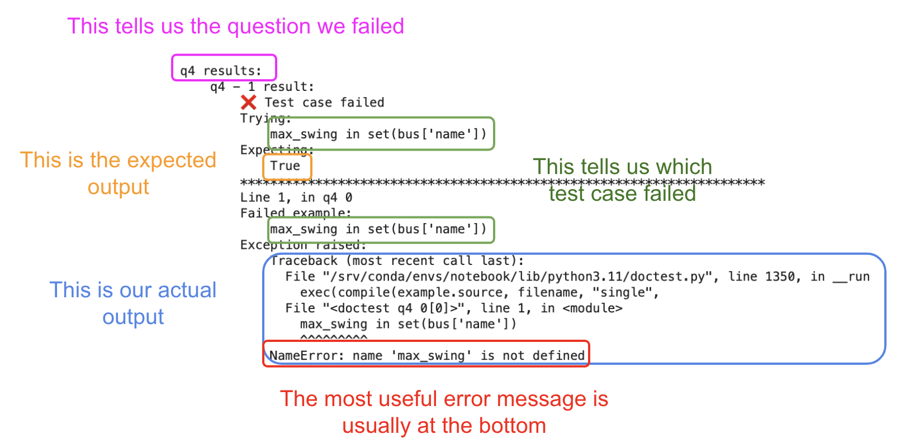
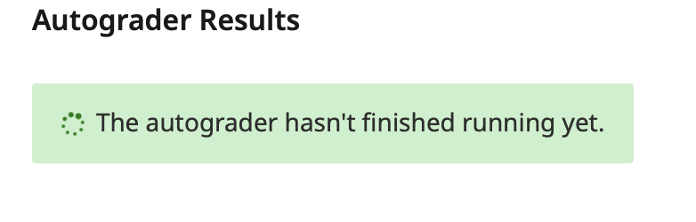

    
Citation

    Many of these common questions were taken and modified from the UC San Diego course DSC 10: Principles of Data Science and their [debugging guide](https://dsc10.com/debugging/).

## Autograder

### Understanding autograder error messages 
When you pass a test, you'll see a nice, concise message and a cute emoji!

</img></a>

When you don't, however, the message can be a little confusing. 

</img></a>

 

The best course of action is to find the test case that failed and use that as a starting point to debug your code. 

</img></a>

### Why do I get an error saying "`grader is not defined`"?
If it has been a while since you’ve worked on an assignment, the kernel will shut itself down to preserve memory. When this happens, all of your variables are forgotten, including the grader. That’s OK. The easiest way to fix this is by [restarting your kernel and rerunning all the cells](https://ds100.org/debugging-guide/jupyter_shortcuts/jupyter_shortcuts.html#restarting-kernel). To do this, in the top left menu, click `Kernel` -> `Restart and Run All Cells`.

### I’m positive I have the right answer, but the test fails. Is there a mistake in the test?
While you might see the correct answer displayed as the result of the cell, chances are your solution isn’t being stored in the answer variable. Make sure you are assigning the result to the answer variable and that there are no typos in the variable name. Finally, [restart your kernel and run all the cells in order](https://ds100.org/debugging-guide/jupyter_shortcuts/jupyter_shortcuts.html#restarting-kernel): `Kernel` -> `Restart and Run All Cells`.

### Why does `grader.export(run_tests=True)` fail if all previous tests passed?
This can happen if you “overwrite” a variable that is used in a question. For instance, say Question 1 asks you to store your answer in a variable named `stat` and, later on in the notebook, you change the value of `stat`; the test right after Question 1 will pass, but the test at the end of the notebook will fail. It is good programming practice to give your variables informative names and to avoid repeating the same variable name for more than one purpose.

### Why does a notebook test fail now when it passed before, and I didn’t change my code?
You probably ran your notebook out of order. [Re-run all previous cells](https://ds100.org/debugging-guide/jupyter_shortcuts/jupyter_shortcuts.html#running-cells) in order, which is how your code will be graded.

### I accidentally deleted something in a cell that was provided to me – how do I get it back?
Suppose you’re working on Lab 5. One solution is to go directly to DataHub and rename your lab05 folder to something else, like lab05-old. Then, click the Lab 5 link on the course website again, and it’ll bring you to a brand-new version of Lab 5. You can then copy your work from your old Lab 5 to this new one, which should have the original version of the assignment.

Alternatively, you can access this [public repo](https://github.com/DS-100/sp24-student) and navigate to a blank copy of the assignment you were working on. In the case of Lab 5 for example, the notebook would be located at `lab/lab05/lab05.ipynb`. You can then check and copy over the contents of the deleted cell into a new cell in your existing notebook. 

## Gradescope

When submitting to Gradescope, there are often unexpected errors that make students lose more points than expected. Thus, it is imperative that you **stay on the submission page until the autograder finishes running**, and the results are displayed. 

### Why did a Gradescope test fail when all the Jupyter notebook’s tests passed?
This can happen if you’re running your notebook’s cells out of order. The autograder runs your notebook from top-to-bottom. If you’re defining a variable at the bottom of your notebook and using it at the top, the Gradescope autograder will fail because it doesn’t recognize the variable when it encounters it.

This is why we recommend going into the top left menu and clicking `Kernel` -> `Restart` -> `Run All`. The autograder “forgets” all of the variables and runs the notebook from top-to-bottom like the Gradescope autograder does. This will highlight any issues. 

Find the first cell that raises an error. Make sure that all of the variables used in that cell have been defined above that cell, and not below.

### Why do I get a `NameError: name ___ is not defined` when I run a grader check?
This happens when you try to access a variable that has not been defined yet. Since the autograder runs all the cells in-order, if you happened to define a variable in a cell further down and accessed it before that cell, the autograder will likely throw this error. Another reason this could occur is because the notebook was not saved before the autograder tests are run. When in doubt, it is good practice to restart your kernel, run all the cells again, and save the notebook before running the cell that causes this error.

### My autograder keeps running/timed out

If your Gradescope submission page has been stuck running on this page for a while: 

</img></a>

or if it times out:

</img></a>

it means that the Gradescope autograder failed to execute in the expected amount of time. This could be due to an inefficiency in your code or a problem on Gradescope's end, so we recommend resubmitting and letting the autograder rerun. **It is your responsibility to ensure that the autograder runs properly**, and, if it still fails, to follow up by making a private Ed post. 
