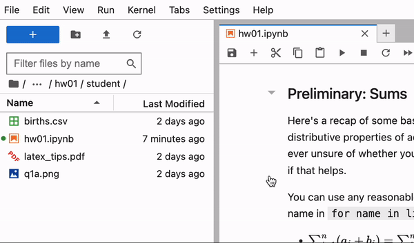

::: {.callout-note collapse="false"}
If you're using a MacBook, replace `ctrl` with `cmd`.
:::

## Shortcuts for Cells

For the following commands, make sure you're in command mode. You can enter this mode by pressing `esc`.

- `a`: create a cell above
- `b`: create a cell below
- `dd`: delete current cell
- `m`: convert a cell to markdown (text cell)
- `y`: convert a cell to code 

## Running Cells

For individual cells, 

- `ctrl` + `return`: run the current cell
- `shift` + `return`: run the current cell and move to the next cell

To run all cells in a notebook: 

- In the menu bar on the left, click `Run`. From here, you have several options. The ones we use most commonly are:

    - `Run All Above Selected Cell`: this runs every cell above the selected cell 
    - `Run Selected Cell and All Below`: this runs the selected cell and all cells below
    - `Run All`: this runs every cell in the notebook from top-to-bottom
 

</img></a>

## Saving your notebook
Jupyter autosaves your work, but there can be a delay. As such, it's a good idea to save your work as often as you remember and especially before submitting assignments. To do so, press `ctrl` + `s`. 

## Restarting Kernel
In the menu bar on the left, click `Kernel`. From here, you have several options. The ones we use most commonly are: 

- `Restart Kernel...`
- `Restart Kernel and Run up to Selected Cell`
- `Restart Kernel and Run All Cells` 

</img></a>

## Automatically Closing Brackets
Many IDEs like VSCode have a functionality that automatically closes brackets. For example, pressing `(`, `{`, or `[` would automatically add the second bracket at the other end `)`, `}`, and `]`, respectively. Datahub does not have this functionality turned on by default, but you can do so by going into `Settings` -> `Auto Close Brackets`. If you see a check mark to the left of `Auto Close Brackets`, then it's enabled. 

</img></a>

