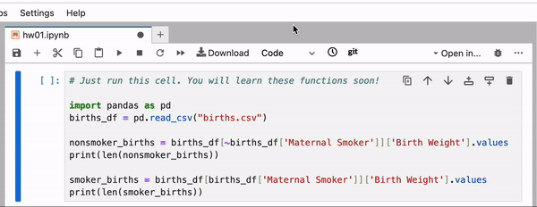
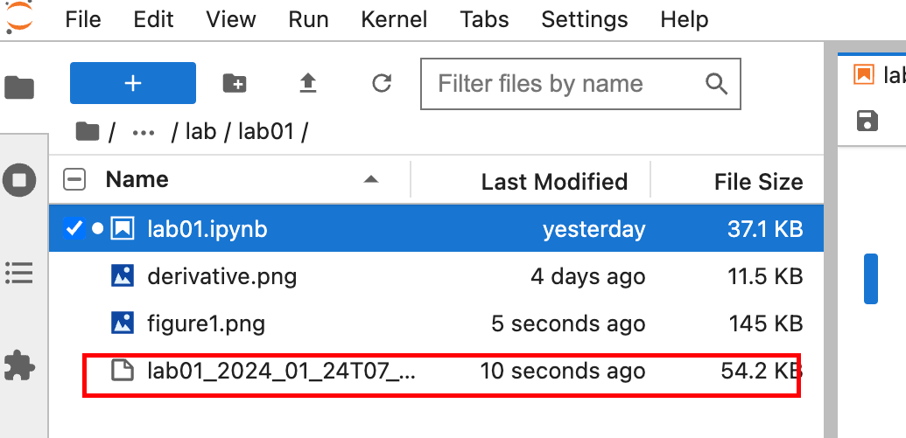
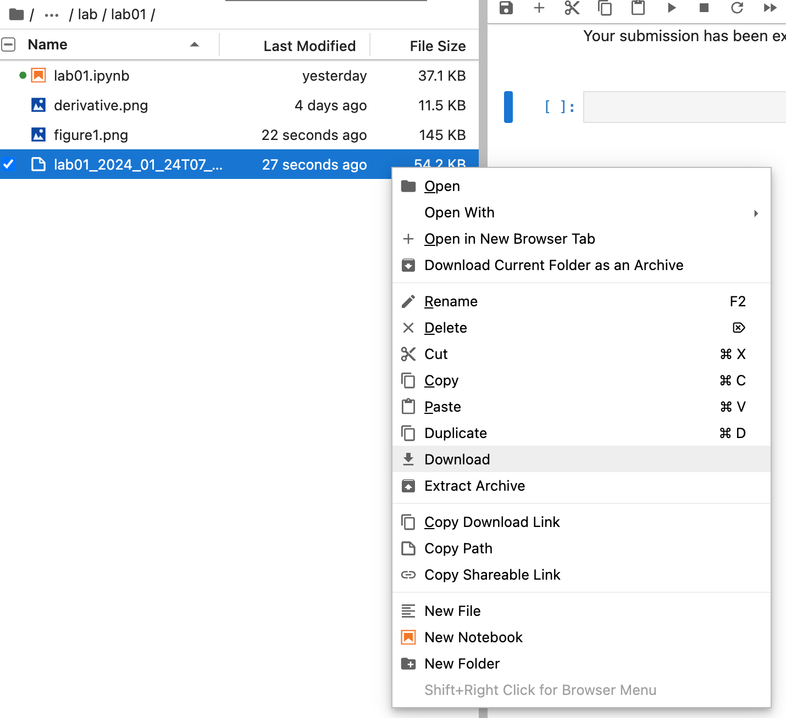
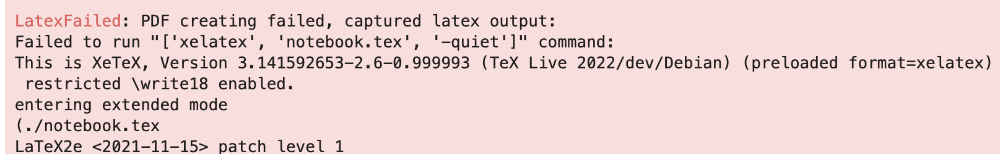

## I can’t edit a cell
We set some cells to read-only mode prevent accidental modification. To make the cell writeable,

1. Click the cell
2. Click setting on the top right corner
3. Under "Common Tools", you can toggle between "Editable" (can edit the cell) and "Read-Only" (cannot edit the cell)

</img></a>

## My text cell looks like code
If you double-click on a text (markdown) cell, it'll appear in its raw format. To fix this, simply run the cell. If this doesn't fix the problem, check out the commonly asked question below.

## My text cell changed to a code cell / my code cell changed to a text cell
Sometimes, a text (markdown) cell was changed to a code cell, or a code cell can't be run because it's been changed to a text (markdown) or raw cell. To fix this, toggle the desired cell type in the top bar.

</img></a>

## Why does running a particular cell cause my kernel to die?
If one particular cell seems to cause your kernel to die, this is likely because the computer is trying to use more memory than it has available. For instance: your code is trying to create a gigantic array. To prevent the entire server from crashing, the kernel will “die”. This is an indication that there is a mistake in your code that you need to fix.

## "Click <u>here</u> to download zip file" is not working
When this happens, you can download the zip file through the menu on the left. 

</img></a>

Right click on the generated zip file and click "Download". 

</img></a>

## I can’t export my assignment as a PDF due to a `LatexFailed` error 
Occasionally when running the `grader.export(run_tests=True)` cell at the end of the notebook, you run into an error where the PDF failed to generate: 

</img></a>

Converting a Jupyter notebook to a PDF involves formatting some of the markdown text in [LaTeX](https://www.latex-project.org/). However, this process will fail if your free response answers have (unresolved) LaTeX characters like `\n`, `$`, or `$$`. If you're short on time, your best bet is to take screenshots of your free response answers and submit them to Gradescope. If you have more time and would like the Datahub-generated PDF, please remove any special LaTeX characters from your free response answers.

