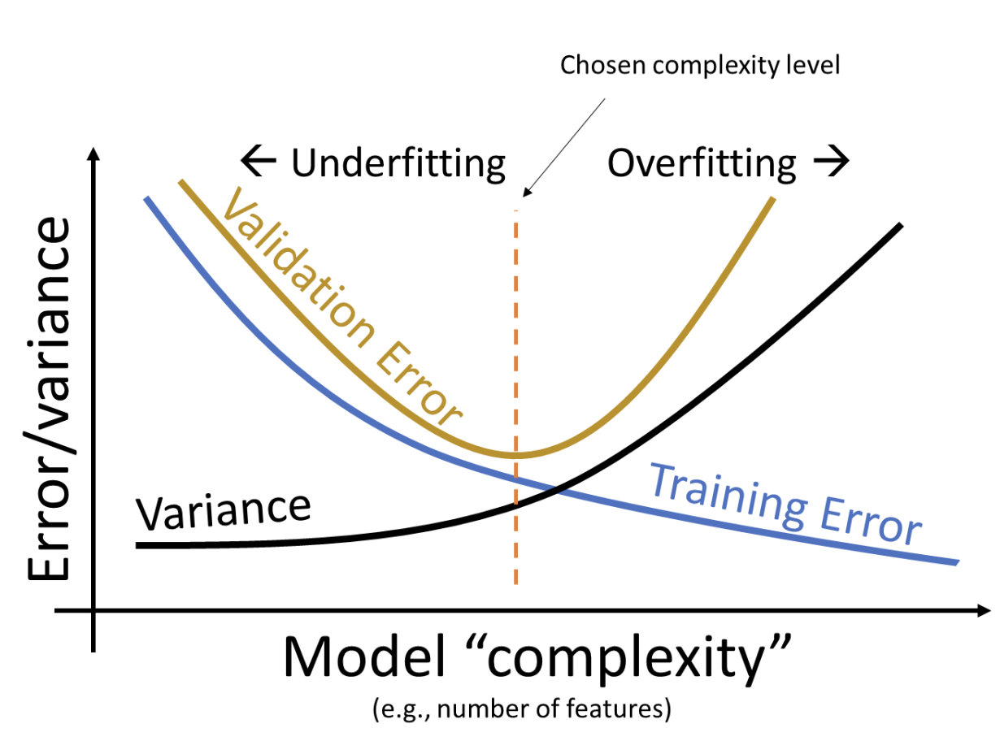

## Question 5d/f

### General Debugging Tips
Question 5 is a difficult and time-consuming question that's mirrors a lot of data science work in the real world: clean data, explore data, transform data, fit a model, and work within a pre-set pipeline. Here are some general debugging tips to make the process easier: 

* Separate small tasks into helper functions, especially if you will execute it multiple times. For example, one-hot-encoding is a good helper function to make because you'll likely perform it on multiple categorical columns. If you're parsing a column with RegEx, it also might be a good idea to separate it out to a helper function. This allows you to verify that you're not making errors in these small tasks and prevents unknown bugs from appearing. 
* Feel free to make new cells to play with the data! As long as you delete them afterwards, it will not affect the autograder. 
* The `feature_engine_final` looks daunting at first, but start small. First try and implement a mode with a single feature to get familiar with how the function works, then slowly experiment with adding one feature at a time. 

### My training RMSE is low, but my validation/test set RMSE is high
Your model is likely overfitting to the training data, and does not generalize to the test set. Recall the bias-variance tradeoff discussed in lecture. As you add more features and make your model more complex, it is expected that your training error will decrease. Your validation and test error may also decrease initially, but if your model is too complex, you'll see they start to increase again.

<center></img></a></center>

Consider visualizing the relationship between the features you've chosen and the (Log) Sale Price and removing the features that are not highly correlated to decrease model complexity. Removing outliers can also help your model generalize better and prevent it from fitting to noise due to outliers.


### `ValueError: Per-column arrays must each be 1-dimensional`
If you're passing the tests for q5d but getting this error in q5f, then your `Y` variable is likely a `DataFrame` instead of a `Series`. `sklearn` models like `LinearRegression` expect `X` to be a 2D datatype (ie. `DataFrame`, 2D `NumPy` array) and `Y` to be a 1D datatype (ie. `Series`, 1D `NumPy` array). 

### `KeyError: 'Sale Price'`/`KeyError: 'Log Sale Price'`
`KeyError`s are raised when a column name does not exist in your `DataFrame`. You could be getting this error because:

* The test set does not contain a `"(Log) Sale Price"` as that's what we're trying to predict. Make sure you only reference the `"(Log) Sale Price"` column when working with training data (`is_test_set=False`).
* You dropped the `"Sale Price"` column twice in your preprocessing code.

### `Value Error: could not convert string to float`

This error usually occurs when your final design matrix has non-numeric columns. The `fit` function of a `lm.LinearRegression` object can take in `pandas` `DataFrame` as the Design matrix (in addition to a 2D `NumPy` Array), but requires that the DataFrame is only composed of numeric values.

### `Input X contains infinity or a value too large for dtype('float64')` 
The reason why you're `X` data contains infinity is likely because you take the log of 0 somewhere in your code. To prevent this, try: 

* Adding a small number to the features that you want to perform the logging operation on so that all values are positive and greater than 0. **Note that whatever value you add to your train data, you should add the same to your test data.**
* Removing zeroes before taking the log.


### `ValueError: Input X contains NaN`
The reason why you're `X` data contains `NaN` values is likely because you take the log of a negative number somewhere in your code. To prevent this, try:

* Shifting the range of values for features that you want to perform the logging operation on to positive values greater than 0. **Note that whatever value you add to your train data, you should add the same to your test data.**
* Removing negative values before taking the log.


### `ValueError: The feature names should match those that were passed during fit`
This error is followed by one or both of: 


```
Feature names unseen at fit time: 
- FEATURE NAME 1
- FEATURE NAME 2
  ...

Feature names seen at fit time, yet now missing
- FEATURE NAME 1
- FEATURE NAME 2
  ...
```

This error occurs if the columns/features you’re passing in for the test dataset aren’t the same as the features you used to train the model. `sklearn`'s models expect the testing data's column names to match the training data's. The features listed under `Feature names unseen at fit time` are columns that were present in the *training* data but not the *testing* data, and features listed under `Feature names seen at fit time, yet now missing` were present in the *testing* data but not the *training* data. 

Potential causes for this error: 

* Your preprocessing for `X` is different for training and testing. Double check your code in `feature_engine_final`! Besides removing any references to `'Sale Price'` and code that would remove rows from the test set, your preprocessing should be the same.
* Some one-hot-encoded categories are present in training but not in testing (or vice versa). For example, let's say that the feature "Data 100" has categories "A", "B", "C", and "D". If "A", "B", and "C" are present in the training data, but "B", "C", and "D" are present in the tesing data, you will get this error: 

    ```
    The feature names should match those that were passed during fit. Feature names unseen at fit time: 
    - D
      ...

    Feature names seen at fit time, yet now missing
    - A
    ```

## Gradescope 

### I don't have many Gradescope submissions left
If you're almost out of Gradescope submissions, try using k-fold cross-validation to check the accuracy of your model. Results from cross-validation will be closer to the test set accuracy than results from the training data. 

### "Wrong number of lines ( __ instead of __ )"
This occurs when you removed outliers when preprocessing the testing data. *Please do not remove any outliers from your test set.* You may only remove outliers in training data.

### Numerical Overflow 

This error is caused by overly large predictions that create an extremely large RMSE. The cell before you generate your submission runs `submission_df["Value"].describe()`, which returns some summary statistics of your predictions. Your maximum value should not go over 25. For your reference, a log sale price of 25 corresponds to a sale price of $e^{25} \approx \$70$ billion which is far bigger than anything found in the dataset. If you see such large predictions, you can try removing outliers from the *training* data or experimenting with new features so that your model generalizes better. 