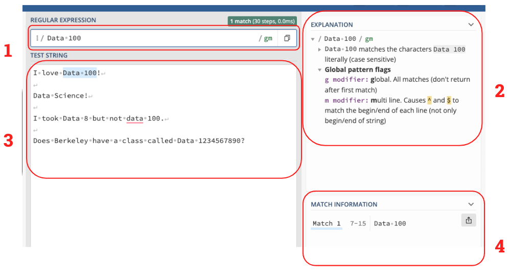
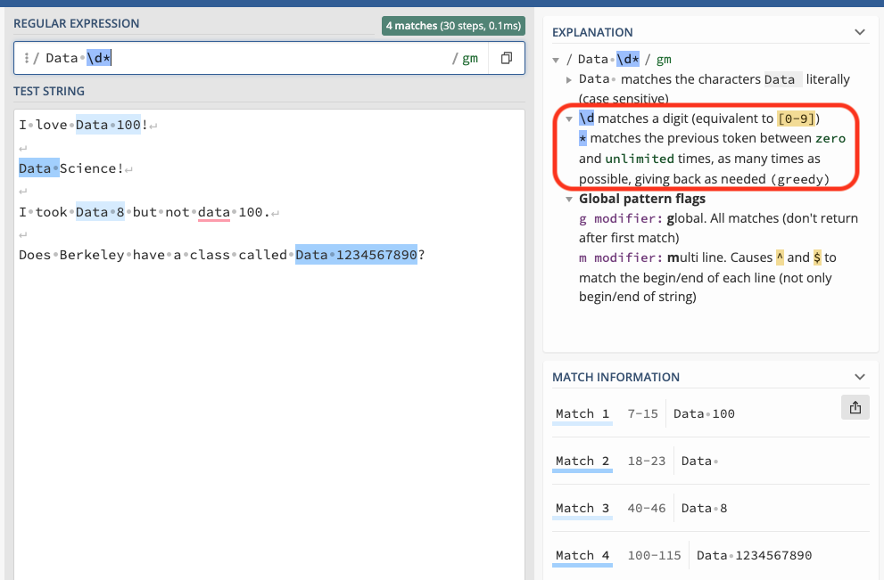
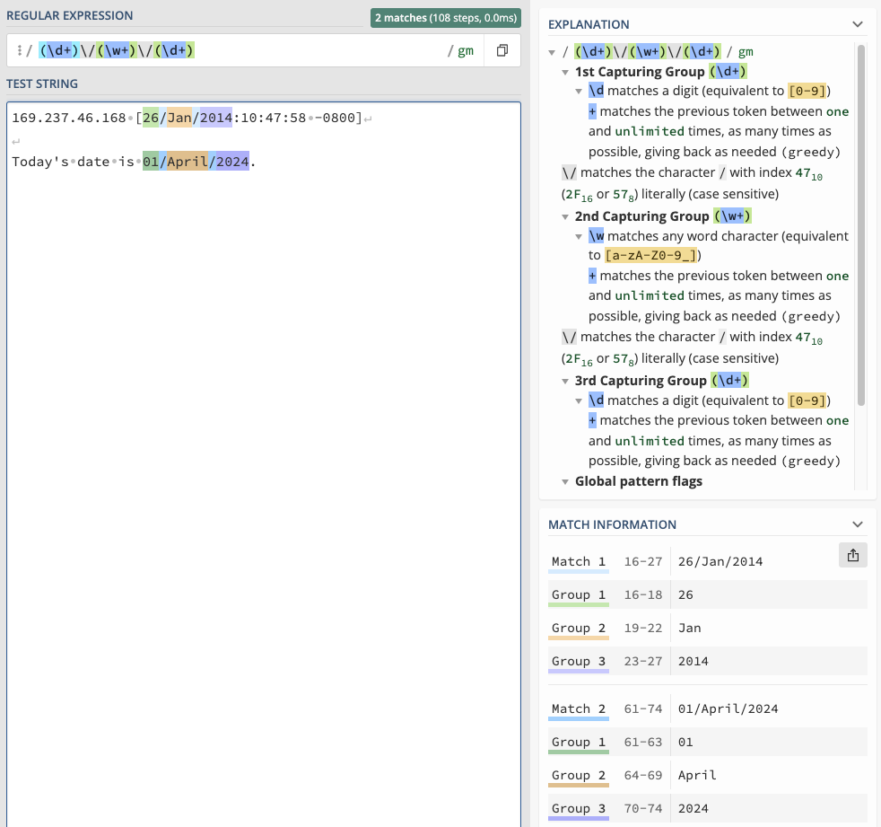

RegEx syntax can be incredibly confusing, so we highly encourage to use sources like the Data 100 Exam reference sheet, which you can find in the "Exam Resources" section in our [Resources page](https://ds100.org/sp24/resources/) or websites like [regex101.com](https://regex101.com/) to help build your understanding. 


## How to Interpret RegEx101
c is a great tool that helps you visually interact with RegEx patterns. Let's take a look at its components with a simple example: 

### Example 1: Basic
<center></img></a></center>
<br>

1. **Regular Expression**: This is where the RegEx expression goes. For this example, our pattern is `Data 100`. In `python`, we denote it as a string `r"Data 100"` with the prefix `r` to indicate that this is a indeed RegEx expression, not a normal `python` string. Using regex101, however, we don't need `r"..."`, just the pattern itself.
2. **Explanation**: This portion of the website explains each component of the pattern above. Since it does not contain any special characters, `Data 100` will match any portion of a string containing `Data 100`.
3. **Test String**: This is where you can try out different inputs and see if they match the RegEx pattern. Of the 4 example sentences, we see that only the first sentence contains characters that match the pattern, highlighted in blue. (Note that while sentence 3 does contain `data 100`, RegEx is sensitive to capitalization. `d` and `D` are different characters)
4. **Match Information**: Each match between the RegEx expression and test strings are shown here. 

### Example 2: Greedy 
For this example, let's replace the `100` in our original expression with `\d*` so that our pattern is `Data \d*`

<center></img></a></center>
<br>

`\d` and `*` are both special operators, and the explanation on the top right (boxed in red) tells us what they do: 

- `\d` matches digits, or any number between 0 and 9. It's equlivalent to `[0-9]`.
- `*` matches the previous token $\geq 0$ times. It is a *greedy operation*, meaning it will match as many characters as possible. 

Altogether, the expression `\d*` will match any digit zero or more times. Look at each match under "Match Information". Can you see why they align with `Data \d*`?

### Example 3: Capturing Groups
Let's say we're given a body of text with dates formatted as `DD/MM/YYY` (ie. 04/Jan/2014), and we're interested in extracting the dates. An expression like `r"\d+\/\w+\/\d+"` would match any string with the `DD/MM/YYY` format: 

* the first `\d+` matches `DD` patterns (ie. `04`)
* `\/` matches the `/` separator. Since `/` is a special operator in RegEx, we need to escape it with `\` to get the literal character.
* `\w+` in the middle matches `MM` patterns (ie. `Jan`)
* lastly, `\d+` matches `YYY` patterns (ie. `2014`)

That's great! This pattern will match the entirety of `DD/MM/YYY`, but what if we want to access `DD` individually? What about `YYYY`? This is where **capturing groups** come in handy. Capturing groups are RegEx expressions surrounded by parenthesis `()`  that are used to remember the text they match so that it can be referenced later. Putting capturing groups around `\d+` and `\w+` to get `r"(\d+)\/(\w+)\/(\d+)"`gives us the following: 

<center></img></a></center>

* The "Explanation" section now shows an explanation for each of the 3 capturing groups. 
* In our test strings, the portion matching the RegEx expression is highlighted in blue per usual. Additionally, each capturing group is highlighted in it's own color: green, orange, and purple. 
* These colored highlights correspond to their match/group under "Match Information". "Match #" (light blue) shows the entire portion that matches the expression while "Group #" shows the match per group. 

#### How do I access captured groups?
To access each group, we use the following syntax: 

```
target_string = "Today's date is 01/April/2024."
result = re.search(r"(\d+)\/(\w+)\/(\d+)", target_string)

result # re.Match object
result.groups() # ('01', 'April', '2024')
result.group(0) # 01/April/2024
result.group(1) # 01
result.group(2) # April
result.group(3) # 2024
```

## RegEx Misconceptions & General Errors

### I’m certain my RegEx pattern in .str.replace is correct, but I’m not passing the grader check. 
Here’s the skeleton from the exam reference sheet: 

  `s.str.replace(pat, repl, regex=False)`

Notice how the `regex=` argument is automatically set to `False`, causing `pandas` to treat `pat` like a normal `python` string. Make sure to set `regex=True`.

### `Value Error: pattern contains no capture groups`
These errors usually occur when using `s.str.extract` or `s.str.extractall`. Read more about in course notes: https://ds100.org/course-notes/regex/regex.html#extraction-with-pandas.
This error means that your RegEx pattern does not match anything in the given `Series` of strings. To debug this, try putting your pattern into `s.str.extract` and `s.str.extractall` and use example strings from the Series as test cases. 
