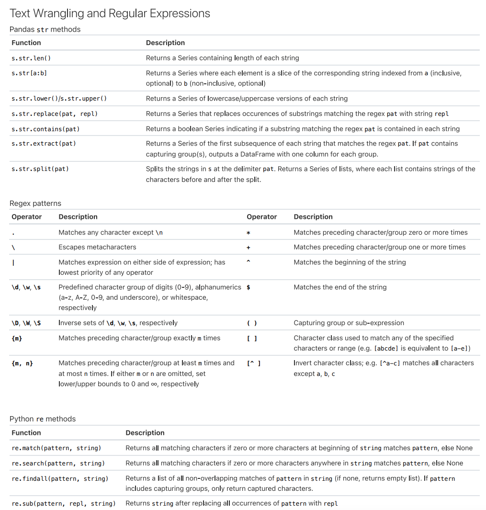
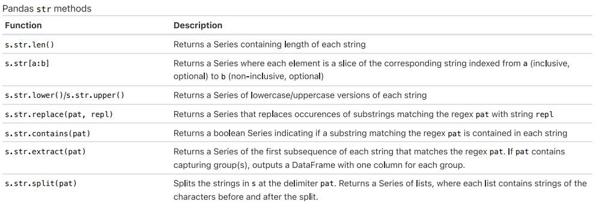

RegEx syntax can be incredibly confusing, so we highly encourage to use sources like the Data 100 Exam reference sheet below or websites like [regex101.com](https://regex101.com/) to help build your understanding. 

<center></img></a></center>


## How to Interpret RegEx101
[regex101.com](https://regex101.com/) is a great tool that helps you visually interact with patterns. Let's take a look at its components with a simple example: 

### Example 1: Basic
<center></img></a></center>
<br>

1. **Regular Expression**: This is where the RegEx expression goes. For this example, our pattern is `r"Data 100"`. In `python`, we denote it as a string `"..."` with an `r` before it to indicate that this is a RegEx expression, not a normal `python` string. Using regex101, however, we don't need `r"..."`, just the pattern itself.
2. **Explanation**: This portion of the website explains what the expression in (1) matches. Since the pattern does not contain any special characters, `"Data 100"` will match any portion of a string containing `"Data 100"`.
3. **Test String**: This is where you can try out different inputs and see if they match the RegEx pattern. Of the 4 example sentences, we see that only the first sentence contains characters that match the pattern, highlighted in blue. (Note that while sentence 3 does contain `"data 100"`, RegEx is sensitive to capitalization. `d` and `D` are different characters)
4. **Match Information**: Each match between the RegEx expression and test strings are shown here. 

### Example 2: Greedy 
For this example, let's replace the `100` in our original expression with `\d*`

<center></img></a></center>
<br>

`\d` and `*` are both special operators, and the explanation on the top right (boxed in red) tells us what they do: 

- `\d` matches digits, or any number between 0 and 9. It's equlivalent to `[0-9]`
- `*` matches the previous token $\geq 0$ times. It is a *greedy* operation, meaning it will match as many characters as possible. 

Altogether, the expression `\d*` will match any digit zero or more times. Look at each match under "Match Information" and convince yourself that they align with `"Data \d*"`.

### Example 3: Capturing Groups
Let's say we're given a body of text with dates formatted as `DD/MM/YYY` (ie. 04/Jan/2014), and we're interested in extracting the dates. An expression like `r"\d+\/\w+\/\d+"` would match any string with the `DD/MM/YYY` format: 

* the first `r"\d+"` matches `DD`
* `r"\/"` matches the `/` separator. Since `/` is a special operator in RegEx, we need to escape it with `\` to get the literal character.
* the middle `r"\w+"` matches `MM`
* the last `r"\d+"` matches `YYY`

That's great! This pattern will match the entirety of `DD/MM/YYY`, but what if we want to access `DD` individually? What about `YYYY`? This is where **capturing groups** come in handy. Capturing groups are regex expressions surrounded by parenthesis `()`  that are used to remember the text they match so that it can be referenced later in the regex pattern or in replacement text. Putting capturing groups around `\d+` and `\w+` to get `r"(\d+)\/(\w+)\/(\d+)"`gives us the following: 

<center></img></a></center>

* The "Explanation" section now shows an explanation for each of the 3 capturing groups. 
* In our test strings, the portion matching the RegEx expression is highlighted in blue per usual. Additionally, each capturing group is highlighted in it's own color: green, orange, and purple. 
* These colored highlights correspond to their match/group under "Match Information". "Match" (light blue) shows the entire portion that matches the expression while "Group #" shows the match per group. 

To access each group, we use the following syntax: 

```
target_string = "Today's date is 01/April/2024."
result = re.search(r"(\d+)\/(\w+)\/(\d+)", target_string)

result.groups() # ('01', 'April', '2024')
result.group(0) # 01/April/2024
result.group(1) # 01
result.group(2) # April
result.group(3) # 2024
```

## RegEx Misconceptions & General Errors

### I’m certain my RegEx expression is correct, but my code isn't working as expected. 

- pandas series str operations allow you to use regex for `contains`, `extract`, `split`
- you need to specify the `regex=True` argument so that the 

<center></img></a></center>

### `Value Error: pattern contains no capture groups`
when nothing is captured by regex pattern 
debugging tip: try out regex pattern on one test string. does it perform as expected? try using regex101