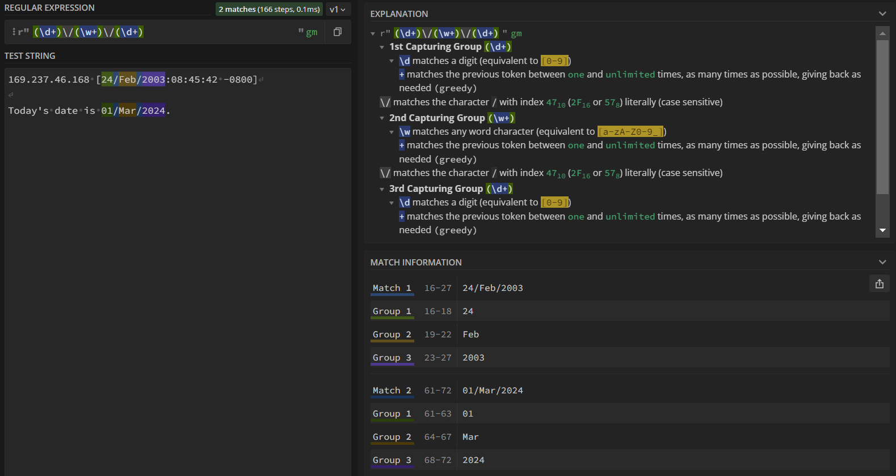

RegEx syntax can be incredibly confusing, so we highly encourage using sources like the Data 100 Exam reference sheet (you can find this under the "Exam Resources" section on our [Resources page](https://ds100.org/sp24/resources/)) or websites like [regex101.com](https://regex101.com/) to help build your understanding. 


## How to Interpret regex101
[Regex101](https://regex101.com/) is a great tool that helps you visually interact with RegEx patterns. Let's take a look at its components with a simple example. 

### Example 1: Basic
<center></img></a></center>
<br>

0. **Flavor**: Regular expressions work slightly differently depending on the programming language you use. In Data 100, we only use the `Python` flavor. By default, regex101 opens on the PCRE2 flavor, so make sure to change to `Python` before experimenting.
1. **Regular Expression**: This is where the RegEx expression goes. For this example, our pattern is `Data 100`. In `Python`, we denote it as a string `r"Data 100"` with the prefix `r` to indicate that this is a RegEx expression, not a normal `Python` string. In regex101, because we changed to the `Python` flavor, we don't need to type out the  `r"` at the start or the `"` at the end, as that's already set up for us.
2. **Explanation**: This portion of the website explains each component of the pattern above. Since it does not contain any special characters, `Data 100` will match any portion of a string containing `Data 100`.
3. **Test String**: This is where you can try out different inputs and see if they match the RegEx pattern. Of the 4 example sentences, we see that only the first sentence contains characters that match the pattern, highlighted in blue. (Note that while sentence 3 does contain `data 100`, RegEx is sensitive to capitalization. `d` and `D` are different characters)
4. **Match Information**: Each match between the RegEx expression and test strings is shown here. 

### Example 2: Greedy 
For this example, let's replace the `100` in our original expression with `\d+` so that our pattern is `Data \d+`

<center></img></a></center>
<br>

`\d` and `+` are both special operators, and the explanation on the top right (boxed in red) tells us what they do: 

- `\d` matches digits, or any number between 0 and 9. It's equivalent to `[0-9]`.
- `+` matches the previous token $\geq 1$ times. It is a *greedy operation*, meaning it will match as many characters as possible. 

Altogether, the expression `\d+` will match any digit one or more times. Look at each match under "Match Information". Can you see why they align with `Data \d+`?

### Example 3: Capturing Groups
Let's say we're given a body of text with dates formatted as `DD/Month/YYYY` (ie. 04/Jan/2014), and we're interested in extracting the dates. An expression like `r"\d+\/\w+\/\d+"` would match any string with the `DD/Month/YYYY` format: 

* the first `\d+` matches `DD` patterns (ie. `04`)
* `\/` matches the `/` separator. Since `/` is a special operator in RegEx, we need to escape it with `\` to get the literal character.
* `\w+` in the middle matches `Month` patterns we're interested in (ie. `Jan`,  `January`)
* lastly, `\d+` matches `YYYY` patterns (ie. `2014`)

That's great! This pattern will match the entirety of `DD/Month/YYYY`, but what if we want to access `DD` individually? What about `YYYY`? This is where **capturing groups** comes in handy. Capturing groups are RegEx expressions surrounded by parenthesis `()`  that are used to remember the text they match so that it can be referenced later. Putting capturing groups around `\d+` and `\w+` to get `r"(\d+)\/(\w+)\/(\d+)"`gives us the following: 

<center></img></a></center>
<br> 

* The "Explanation" section now shows an explanation for each of the 3 capturing groups. 
* In our test strings, the portion matching the RegEx expression is highlighted in blue per usual. Additionally, each capturing group is highlighted with a particular color: green, orange, and purple. 
* These colored highlights correspond to their match/group under "Match Information". "Match #" (light blue) shows the entire portion that matches the expression while "Group #" shows the match per group. 

#### How do I access captured groups?
To access each group, we use the following syntax: 

```
target_string = "Today's date is 01/March/2024."
result = re.search(r"(\d+)\/(\w+)\/(\d+)", target_string)

result # re.Match object
result.groups() # all captured groups: ('01', 'March', '2024')
result.group(0) # '01/March/2024', the full match
result.group(1) # '01', the first captured group
result.group(2) # 'March', the second captured group
result.group(3) # '2024', the third captured group
```

## RegEx Misconceptions & General Errors

### I'm certain my RegEx pattern in `.str.replace` is correct, but I'm not passing the grader check. 
Here's the skeleton from the exam reference sheet: 

  `s.str.replace(pat, repl, regex=False)`

Notice how the `regex=` argument has a default value of `False`, causing `pandas` to treat `pat` like a normal `Python` string. Make sure to set `regex=True` if you're using RegEx!

### My RegEx pattern matches the test cases on regex101, but is not working in `pandas` with `.str.findall` / `.str.extractall` / `.str.extract`.  

The most likely reason for this is forgetting to include the `r` before the string with your regular expression. Without including the `r` in `.str.findall(r".*")`, `pandas` will not interpret your pattern as a regex expression and will only match it literally.

### `Value Error: pattern contains no capture groups`
These errors usually occur when using `s.str.extract` or `s.str.extractall`. Read more about it in the [RegEx course notes](https://ds100.org/course-notes/regex/regex.html#extraction-with-pandas).
This error means that your RegEx pattern does not match anything in the given `Series` of strings. To debug this, try putting your pattern into [regex101.com](https://regex101.com/) and use example strings from the Series as test cases. 

### When do I need to escape characters?

The special characters in RegEx are: `. ^ $ * + ? ] [ \ | ( ) { } }`

If you want to match exactly those characters in a RegEx expression, you need to "escape" them by preceding them with a backslash `\`. However, the rules around this can change in the context of character classes. 

For example, the pattern  `r"[.]"` matches  `'.'`, the literal period. In this context, it is not treated as a special character. The hyphen, while not included in the list of special characters, also changes its behavior depending on its position in a character class. It can be used to specify a range of characters (e.g. `r"[0-9]"`) based on their Unicode values, or match a literal `'-'` if it does not have two adjacent characters (e.g. `r"[-09]"` matches `-`, `0`, `9`). To be on the safer side, you could escape `-` like in `r"[0\-9]"` to achieve the same result.

Finally, it's generally good practice to escape both single and double quotes for greater readability. Technically, patterns like `r"'(.\*)'"` and `r'"(.\*)"'` do work as you'd expect, but you can already see how confusing it is to decipher what's going on. Escaping the quotes inside the pattern does not affect what matches you get, but makes it easier to figure out what the intended match was.

### The three uses of `^` 

The `^` character can be tricky to wrap your head around given how its function changes depending on the context:

1. If used at the start of a pattern, like in `r"^\w"`, it means that a lowercase letter must begin the string in order for a match to occur. 
2. If included at the start of a character class, like in `r"[^abc]"`, it negates all the characters in that class and will match with any other character – in the above example, any character that is not `a`, `b`, `c`. 
3. Finally, if escaped as in `r"\^"` it is treated as a literal and will match any instance of `^`. 

### What's the difference between all the `re` functions?

The exam reference sheets give a few `re` functions, but how can you determine which one to use? 

<center></img></a></center>
<br>

`re.match` and `re.search` only return *one* instance of a match between string and pattern (or None if there's no match) 
- `re.match` only considers characters at the beginning of a string
- `re.search` considers characters anywhere in the string
- For example: 
  ``` 
  pattern = r"Data 100" 
  example1 = "Data 100 is the best!" 
  example2 = "I love Data 100!" 

  re.match(pattern, example1).group(0) 
  # matches "Data 100" 
  re.match(pattern, example2) 
  # does not match "Data 100" because it's not at the beginning of a string; returns None

  re.search(pattern, example1).group(0) # matches "Data 100" 
  re.search(pattern, example2).group(0) # matches "Data 100" 
  ```

If, instead, you're interested in finding *all* matches between the given string and pattern, 
`re.findall` will find them all, returning the matches in a list.

```
re.findall(r'\d+', 'Data 100, Data 8, Data 101') 
# returns a list of strings: ['100', '8', '101']

re.findall(r'\d+', 'Data science is great')  
# no matches found, returns empty list: []
```

`re.sub` will find them all *and replace it* with a string of your choice.

```
re.sub(r'\d+', 'panda', 'Data 100, Data 8, Data 101') 
# returns 'Data panda, Data panda, Data panda'

re.sub(r'\d+', 'panda', 'Data science is great')  
# no matches found, returns the original string "Data science is great" 
```

### What's the difference between `re` functions and `pd.Series.str` functions?

Generally, all the `pd.Series.str` functions are used when you want to apply a Python or RegEx string function to a _Series of strings_. In contrast, `re` functions are applied to string objects. The reference sheet gives a great overview of the different use cases of each of the `pd.Series.str` functions. 