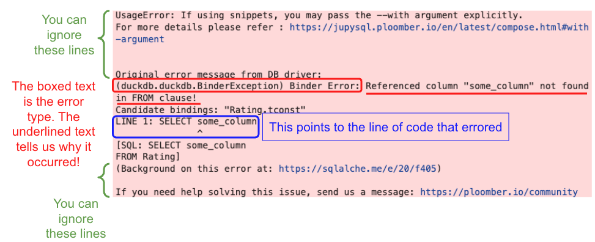

## Common Misconceptions
### How to read SQL Errors
Because Jupyter notebooks run Python natively, we need to import extra modules like `sql`, `sqlalchemy`, and `duckdb` in order to run SQL queries within our notebook. This results in slightly more complex error messages than normal Python. Refer to the image below if you need help identifying the most important parts (the red and blue text). 

<center></img></a></center>

Sometimes, SQL errors may show up as a long string without any red highlight, for example: 

`(duckdb.duckdb.BinderException) Binder Error: Referenced column "some_column" not found in FROM clause!
LINE 1: SELECT some_column
               ^`
`...`

Note that this is the same error as the one above -- it's just not formatted nicely. Try your best to parse it; you can even copy the error into a new cell and manually indent sentences if it helps with readability!

### Comments in SQL
Unlike `Python`, which uses `#...` or triple quotes `"""..."""` to indicate a comment, SQL comments take the following forms: 

```
-- This is a single-line or in-line comment

/* 
  This is a 
  multi-line 
  comment 
*/
```

Because you are still coding within a Python notebook, the colors that Jupyter chooses for your SQL queries may not match up to what you expect; using `#...` will be green text like Python comments, but running the code will give you:

 `Parser Error: syntax error at or near...`
 
Using `--` or `/* ... */` may not color-code the text correctly, but SQL will still read it as a comment! 

<!-- 
Note: not including this one since we switched from Lisa's grading method of pickling files to Rohan's method with the uppdated Otter Grader

## Failing on Gradescope but passing locally

This usually occurs when an unzipped file is submitted to Gradescope. Please directly submit the file downloaded through the link under the final submission cell of the notebook to Gradescope (no need to unzip it). The zip file should contain a results folder containing .pkl files in it.

Submit the full zip files. Don’t unzip it before submitting to Gradescope. -->

### Filtering with multiple conditions

When you are using more than one condition in filtering clauses like `WHERE` or `HAVING`, it's important consider that the ordering of `OR`s and `AND`s will affect your SQL output.

In `SQL`, the operator precedence typically evaluates `AND` operations before `OR` operations, and so incorrectly ordered conditions can lead to unexpected results. To ensure your conditions are evaluated in the intended order, use parentheses to group them explicitly.

For example, consider the following query condition:

`WHERE A > 500 AND B > 200 OR C < 50`

By default, is will be evaluated as 

`WHERE (A > 500 AND B > 200) OR C < 50`

because `AND` has a higher precedence than `OR`. To evaluate it differently, add parentheses to specify the order of operations:

`WHERE A > 500 AND (B > 200 OR C < 50)`

### Truncated Display Limit
Our Jupyter Notebooks are set to only display the first 10 rows of a table. Otherwise, your notebook would likely crash with the weight of displaying >1000 rows. You'll likely see a 

`Truncated to displaylimit of 10`

printed right below your SQL query if your table contains more than 10 rows. 

## Common Errors
### `NameError: name ‘[res_q#]’ is not defined`
This occurs when you have an error in your SQL code, causing the cell after to fail. Because we're working with Jupyter Notebooks, some SQL errors are not highlighted in red like `Python` errors usually are. Check the output under your `%%sql` cell to see if it ran smoothly. Any text below 

`Running query in 'duckdb:///data/{database_name}.db`

is an error message that you can read to debug your code. Note that this error could be formatted as one long string without any indents or newlines, so it may be harder than typical `Python` errors to parse.

<!--
Note: Not included as these questions don't come up as frequently in the HW, but can be added later if need be
#### **Some scenarios and fixes**


**1. Incorrect Alias Usage**

- **Issue:** Referring to a column or table using its original name instead of the alias assigned with the `AS` keyword.
- **Solution:** Always use the alias, if you have assigned one, when referencing a column or table. For example, if you set `SELECT column AS col FROM table`, use `col` in your subsequent references.

**2. Ambiguous Column Reference in Joins**

- **Issue:** Referring to a column that exists in both tables being joined, without specifying which table's column to use.
- **Solution:** Specify the table from which to select the column from. Use the format `tableName.columnName` to clear up the ambiguity. For example, if joining `tableA` and `tableB`, both containing `column`, specify `tableA.column` or `tableB.column`.

-->

### `Referenced column "{some_string}" not found`
There are 2 potential causes for this error: 

1. **The column you're looking for does not exist in the table.** Make sure that the column names are spelled and capatalized exactly as shown in the assignment. If you are trying to reference a column that is not in the current table, consider using `JOIN` to be able to access these columns. You can reference the [SQL II course notes](https://ds100.org/course-notes/sql_II/sql_II.html#joining-tables) for a refresher on how to use the `JOIN` clause.
2. **You used double quotes `""` around `some_string` instead of single quotes `''`**. Unlike `Python`, SQL differentiates double and single quotes: double quotes indicate something that exists within the database, like tables and column names; single quotes indicate strings. 

<!-- Does not error using duckdb

## Error message near `CASE`

You may run into errors near the `CASE` clause if you are creaing a column using `CASE` and then referencing the new column in the `SELECT` clause as well. 

When you are using `CASE` within `SELECT`, the new column will automatically be selected. You can reference the course notes [here](https://ds100.org/course-notes/sql_II/sql_II.html#using-conditional-statements-with-case) for a refresher on how to use the `CASE` clause. -->


### `Cannot compare values of type __ and type __`
This error often occurs when a string-type column (ie. `CHAR` or `VARCHAR`) is compared with a numeric-type column (ie. `INT`, `BIGINT`, `FLOAT`, `REAL`). If you're interested in learning more about SQL datatypes, check out [this link](https://www.w3schools.com/sql/sql_datatypes.asp)! 

To debug, start by checking the type of the column(s) you're working with; you can either scroll up to the cell (or make a new cell) with the code: 

```
%%sql
SELECT * FROM sqlite_master WHERE type='table';
```

which outputs the schema for each table. If we're working with the IMDB database, we get the following output: 

<center></img></a></center>


We can see that the table `Title` contains the columns

* `tconst` of type `BIGINT`
* `titleType` of type `VARCHAR`
* `primaryTitle` of type `VARCHAR`
* and so on...

It's a good idea to double check the types of the columns involved by looking at the schema before performing numerical comparisons and when deciding whether to `CAST` a particular column. 

### My query runs but I'm not passing the tests

For a lot of questions in the homework, we limit our focus to **movie** titles. Double check that you are filtering your results appropriately. More generally, if you find your queries aren't erroring, but are failing the tests due to some logical error, a good starting point is always reading the question again and making a checklist of all the conditions you need to implement.

<!-- Not including cuz duckdb fixes this

##Incorrect data types with `CAST`

It is important to use only the supported data types when casting, otherwise the query will result in an error. SQL supports casting to and from the following data types:

- **Integer Types**: `bigint`, `int`, `smallint`, `tinyint`
- **Boolean Type**: `bit`
- **Decimal Types**: `decimal`, `numeric`, `money`, `smallmoney`
- **Floating Point Types**: `float`, `real`
- **Date and Time Types**: `datetime`, `smalldatetime`
- **Character Strings**: `char`, `varchar`, `text`
- **Unicode Character Strings**: `nchar`, `nvarchar`, `ntext`
- **Binary Strings**: `binary`, `varbinary`, `image`

For example, doing `CAST(num AS integer)` will error since `int` is a supported data type, but `integer` is not. -->

<!--
Note: Not included as these questions don't come up as frequently in the HW, but can be added later if need be

## Frame not returned when using (...) in filtering

In `SQL`, tuples are a sequence of values grouped together by parenthesis. They are meant for use with the `IN` keyword when filtering data based on set membership. You need to be careful when using tuples with other filtering keywords such as `LIKE`.

#### **Incorrect usage:**

1.  `WHERE item LIKE ('%orange%' OR '%strawberry%')`
2.  `WHERE item IN ('fruit', 'vegetable')`

#### **Correct usage:**

1. `WHERE (item LIKE '%orange%' OR item LIKE '%strawberry%')`
2. `WHERE item IN ('fruit', 'vegetable')`

-->