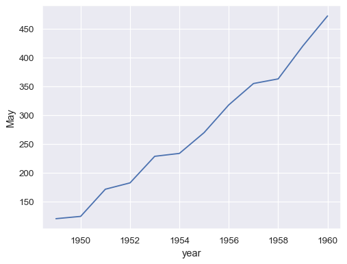

Visualizations are how data scientists use to communicate their insights to the world. In the process of making a [good visualization](https://ds100.org/course-notes/visualization_2/visualization_2.html#harnessing-context), be it while adding a legend or setting the x-axis label, we may run into some errors. Let's take a look at how to resolve them below!


### My legend’s labels don’t match up / my legend isn’t displaying properly

If you simply add `plt.legend()` after your plotting line of code, you should see a legend; seaborn will sometimes automatically populate the legend. However, if you’re plotting multiple lines or sets of points on a single plot, the labels in the legend may not correctly line up with what’s shown. 

Make sure to pass in the `label` argument into the `sns` plotting function with the label you want associated with that individual plot. For example, 

```
sns.histplot(means_arr, label = 'simulated values') # informative label name
plt.title('Simulated values') 
plt.plot(original, 10, 'bo', label = 'original test statistic') # informative label name
plt.legend(loc = 'upper left') # can specify location of legend
```
<center></img></a></center>
<br>

## The y-axis of my `histplot` shows the count, not the density

Look into the `sns.histplot` [documentation](https://seaborn.pydata.org/generated/seaborn.histplot.html) and see what arguments the `stat` parameter takes in. By default, `stat=count`, and the number of elements in each histogram bin is the y axis. But if you wanted to normalize the distribution such that the total area is 1, consider passing `stat=density` into the plot function.

## I’m having trouble labeling the axes/title of my graph 
To label the axes and title of a graph, we use the following syntax: 

```
plt.xlabel(“x axis name”) 
plt.ylabel(“y axis name”) 
plt.title(“graph title”) 
```

Where `plt.xlabel`, `plt.ylabel`, and `plt.title` are matplotlib functions that we call. 

However, we often see students use the following incorrect syntax to try and label their plot: 

```
plt.xlabel = "x name"
plt.ylabel = "y name"
plt.title = "graph title"
```
Now, instead of `plt.xlabel`, `plt.ylabel`, and `plt.title` being functions, they are strings. Trying to call one of the labelling function using the correct syntax in the next few cells (ie.` plt.xlabel(“x name”)`) will result in a `TypeError: str object is not callable`. If this happens to you, comb through your notebook and look for places when you used the incorrect syntax. After fixing it, [restart your kernel](https://ds100.org/debugging-guide/jupyter101/jupyter101.html#restarting-kernel) and [rerun your cells](https://ds100.org/debugging-guide/jupyter101/jupyter101.html#running-cells). 

## My `sns.lineplot` has an unwanted shaded region around the solid lines.
>Note: the following examples are taken from `sns.lineplot`'s [documentation](https://seaborn.pydata.org/generated/seaborn.lineplot.html). 

`sns.lineplot` gives us a clean line when each `x` value has one `y` value. For example, the table 

| Year | May | 
| --- | --- | 
| 1948 | 120 | 
| 1949 | 122 | 
| 1950  | 123| 
| $\vdots$ | $\vdots$ | 

will give us a clean plot because each year corresponds to a single "Number of Flights in May" value. 

<center></img></a></center>
<br>

When each x value has multiple y values, `sns.lineplot` will automatically plot a shaded region around the solid line, where the solid line is the mean of the y values for that x value (think of a groupby on x aggregated by `.mean()` on y) and the shaded region is the 95% confidence interval (read more about confidence intervals in the [Data 8 textbook](https://inferentialthinking.com/chapters/13/3/Confidence_Intervals.html?highlight=confidence+intervals)). For example, the table 

| Year | May | 
| --- | --- | 
| 1948 | 115 | 
| 1948 | 120 | 
| 1948 | 125 | 
| 1949 | 118 | 
| 1949 | 122 | 
| 1949 | 126 |
| $\vdots$ | $\vdots$ | 

will plot a lineplot with a shaded region. 

<center></img></a></center>
<br>

If you do not want the shaded region, aggregate the data such that there is only one y-value for a given x-value; then, make the plot.